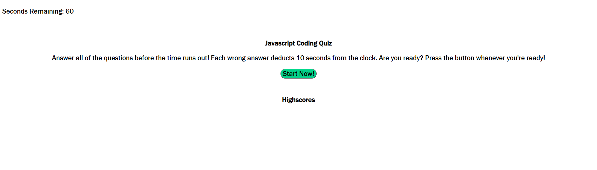

<br>
<p align="center">
   <h2 align="center">Javascript Coding Quiz</h2>
</p>
<br>

## About the project
This is a coding quiz that runs through a series of basic Javascript questions, then at the end of the quiz, allows the user to save their highscore and logs it to the high score section of the page. It utilizes Javascript as the primary language. The project utilizes loops to properly display each consecutive question afte the previous is answered and then utilizes local storage to save and display high score times.

### How to view project

To view this project, simply go to https://zd092718.github.io/zdcodingquiz/ to view the finished product. 

To see the code for the site:

* Clone the repo

    ```sh
    git clone https://github.com/Zd092718/zdcodingquiz
    ```

### Built With

* HTML5
* CSS3 
* Javascript

### Preview Image
<br>




## Contact

Zachary Dowd - zdowd2796@gmail.com

Project Link - https://github.com/Zd092718/zdcodingquiz